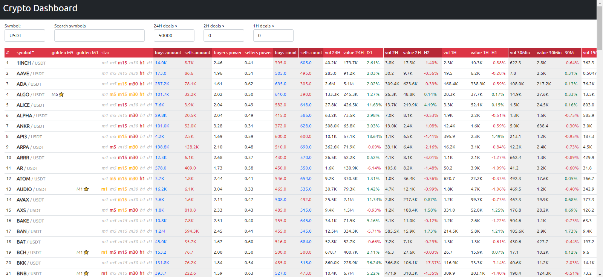

# Crypto Dashboard

This project helps you to track the crypto-currencies `value` and `volume` changes and will give them star marker if some wierd change happens.  
The crypto data obtained via `Coinex` exchange API.

## How to run:  
- install `nodejs` on your computer
- goto src and run `npm i`
- run `npm run start` and then open `http://localhost:3003` on your browser

Feel free to suggest any changes.
